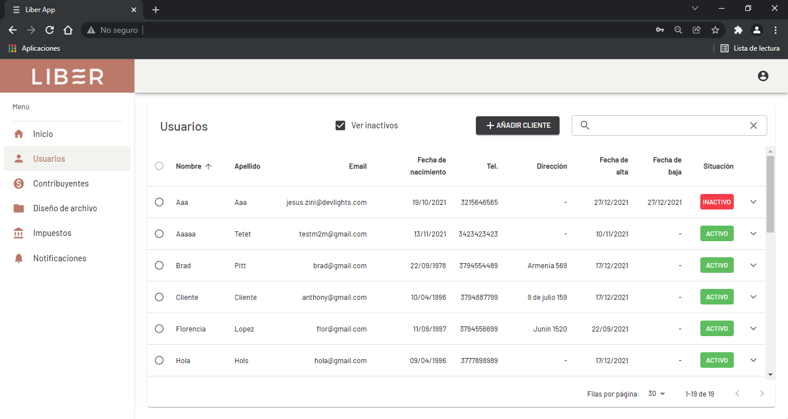
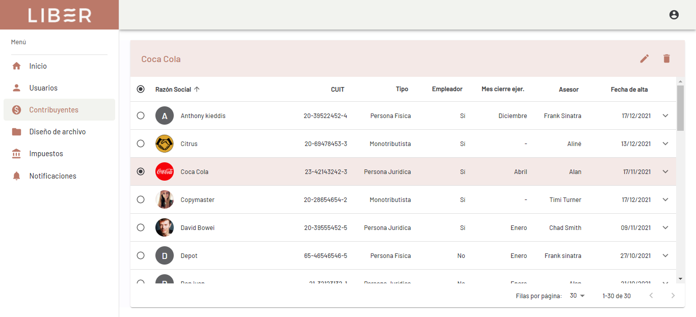
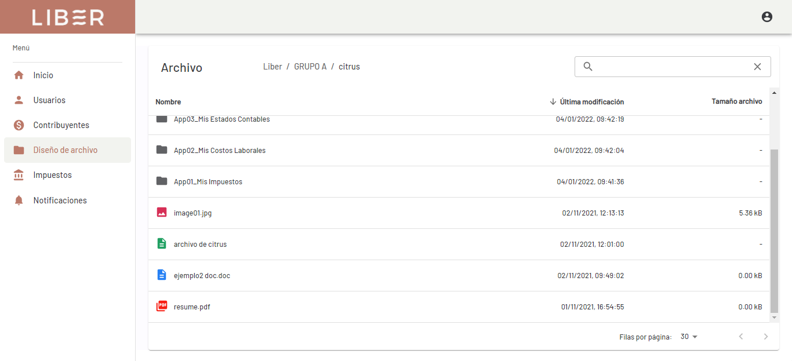
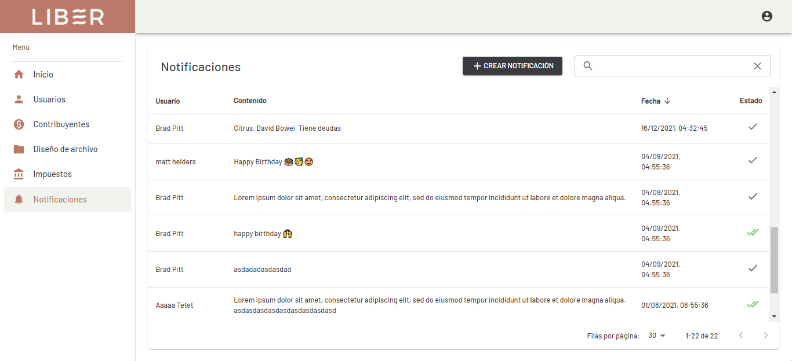

## Liber App 👨‍💼💼

Webapp for accounting study.  

## Stack used 💻

- Node
- Express
- Typescript
- PostgreSQL
- React
- Redux-Toolkit
- Material-UI
- Docker
- Docker-Compose
- Nginx

## Some features ⚙️

- Google Drive Api
- Firebase Cloud Messaging
- ETL with SheetJS
- Passport JWT
- Nodemailer
- Node-cron

## Images 📷

 

